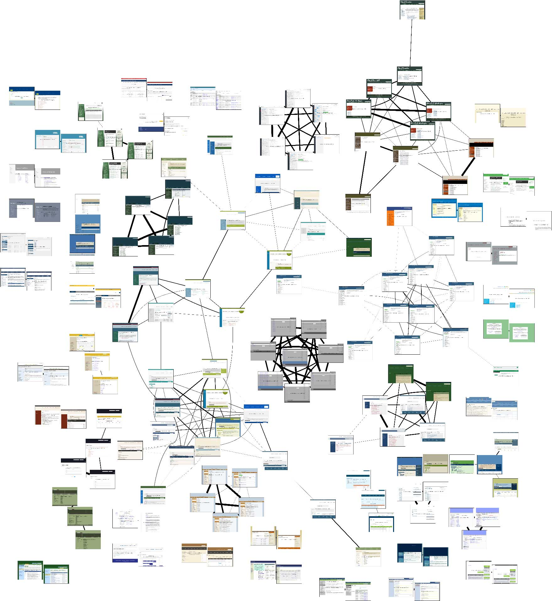
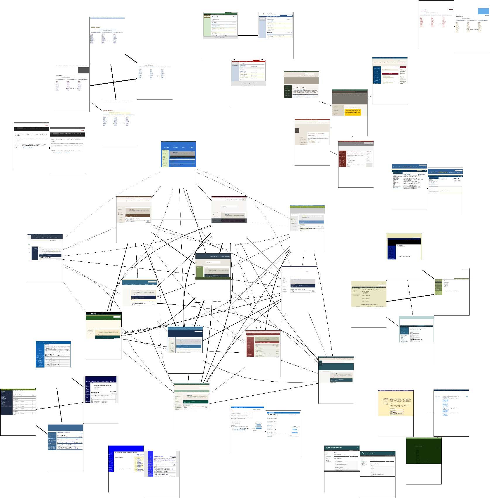

# THIS REPO IS UNDER DEVELOPMENT

# HTML Cluster

[](https://travis-ci.org/matiskay/html-cluster)

A command line tool to cluster html pages based on structural and style similarity.

## Install

The quick way:

```
pip install html-cluster
```

## How it works

1. Download HTML form a list of files.

```
html-cluster download-html urls.txt
```

2. Create a similarity score file.

```
html-cluster make-score-similarity-file --structural-weight=0.3
```

3. Create the graph dot file

```
html-cluster make-graph similarity_score.json > graph.dot
```

4. Render the image

```
neato -O -Tpng graph.dot
```

## Splash

We use splash to take screenshots. You can use the following bash script to run
it using docker

```bash
#!/usr/bin/env bash

echo 'Splash is running on http://127.0.0.1:8050'
docker run -p 5023:5023 -p 8050:8050 -p 8051:8051 scrapinghub/splash
```

## Examples of the images generated by the script

### Example 1 using Splash



### Example 2 using Splash




### Example 2 without using Splash. Default behaviour


